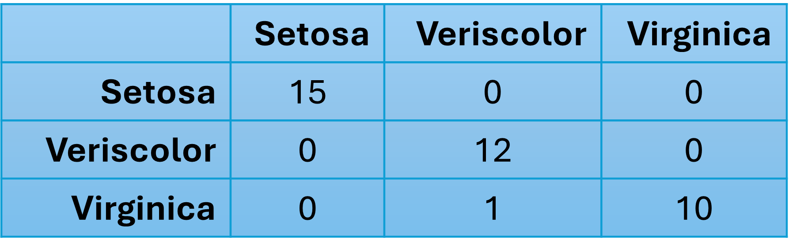

# Iris Species Classification — Logistic Regression

This project applies **logistic regression** to the classic **Iris dataset**, focusing on binary classification and model evaluation. The aim was to build a classifier capable of identifying whether a flower belongs to the *Iris-setosa* species or not, using measured sepal and petal characteristics.

Although the Iris dataset is widely used, I approached this task as an opportunity to demonstrate **careful problem framing, evaluation logic, and clear interpretation of classification results**, rather than simply implementing a model.

Image from https://www.datacamp.com/tutorial/machine-learning-in-r.

### What’s in this repository

- **Jupyter Notebook:** step-by-step analysis (`iris_logistic_regression.ipynb`)    
- **Images:** visuals
- **Source data:** csv dataset (`Iris.csv`)  
- **Requirements:** Python dependencies (`requirements.txt`)

### Project Context

The Iris dataset contains measurements of iris flowers — sepal length, sepal width, petal length, and petal width — along with their corresponding species labels.

For this task, the classification problem was initially simplified to a **binary outcome**:

- **0:** Iris-setosa  
- **1:** Not Iris-setosa (Iris-versicolour and Iris-virginica)

This framing allowed a focused exploration of logistic regression as a probabilistic classifier and provided a clear context for evaluating precision, recall, and accuracy. Then the project was extended to classify the three distinct species. The task required manual calculation of precision etc.

### Approach and Key Steps

The analysis followed a structured supervised learning workflow:

- **Feature selection:** Identified the flower measurements as independent variables.
- **Target encoding:** Encoded species labels into binary form to support logistic regression.
- **Train–test split:** Divided the dataset to allow unbiased model evaluation.
- **Model training:** Used scikit-learn’s `LogisticRegression` class to fit the classifier.
- **Prediction:** Generated predictions on unseen test data.

### Model Evaluation and Interpretation

To evaluate classifier performance, I examined results using multiple approaches:

- **Confusion matrix:** Used to visualise true positives, false positives, true negatives, and false negatives.
My model has difficulty distinguishing versicolor and viriginica in some cases: the Virginica-Versicolor entry in the confusion matrix is non-zero.

  
- **Manual metric calculation:** Implemented custom calculations for:
  - Accuracy  
  - Precision  
  - Recall  

These manually computed values were then compared against scikit-learn’s built-in metrics to confirm correctness.

This process strengthened my understanding of how evaluation metrics relate directly to confusion matrix outcomes, and why accuracy alone is often insufficient for classification problems.

### Skills Demonstrated

- Binary classification with logistic regression  
- Target encoding and problem framing  
- Train–test splitting and prediction  
- Confusion matrix interpretation  
- Manual calculation of accuracy, precision, and recall  
- Python data science tools: pandas, scikit-learn, matplotlib / seaborn  

### Requirements

Install the required Python packages with: `pip install -r requirements.txt`

